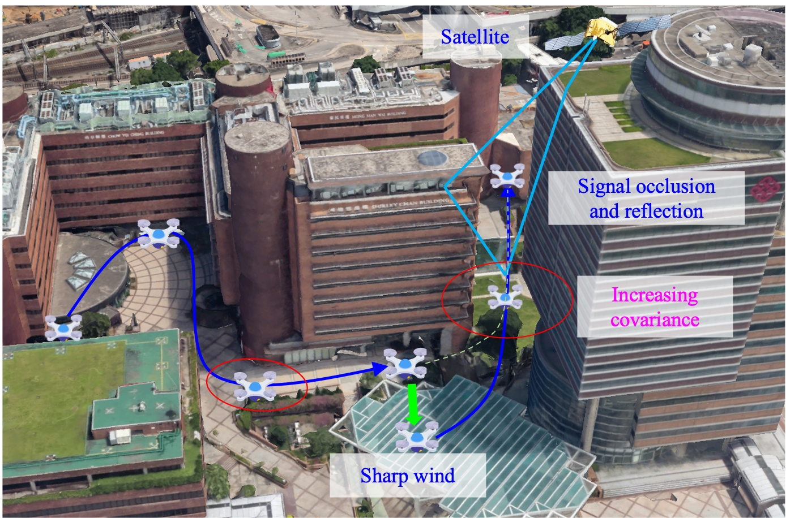
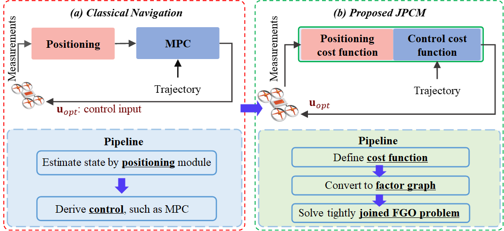
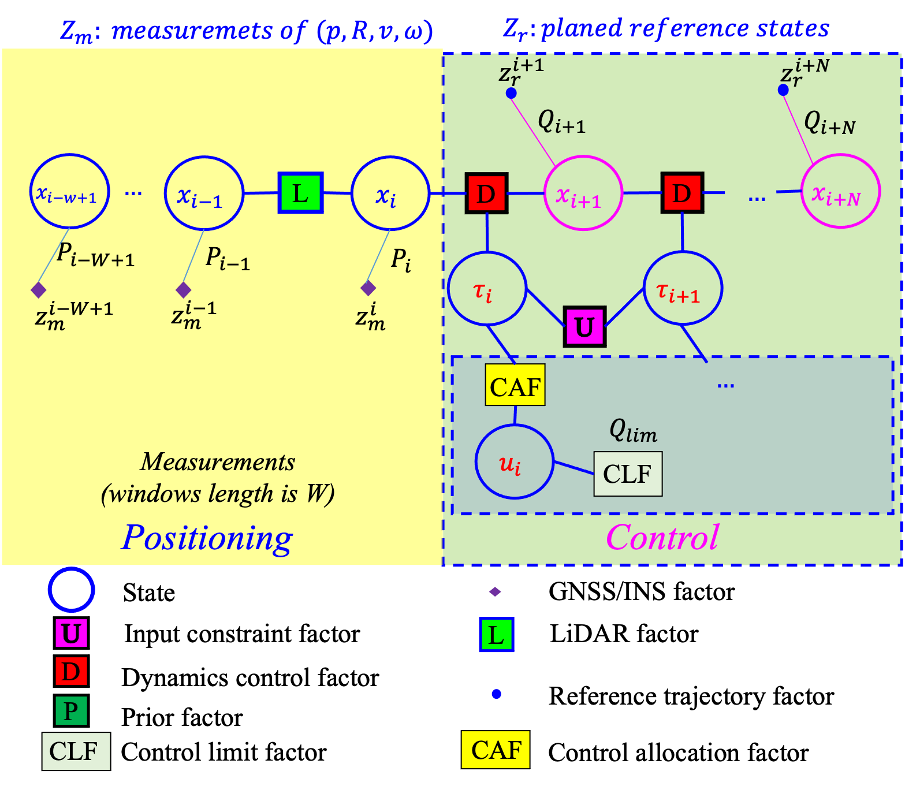
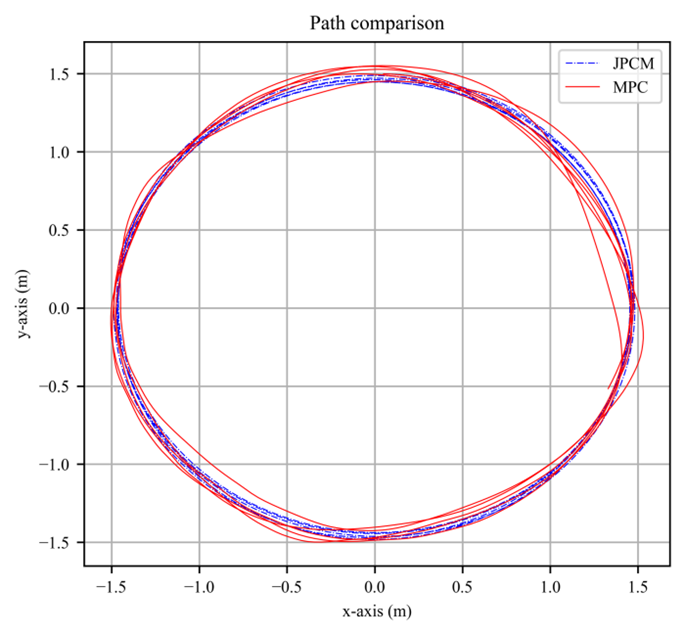
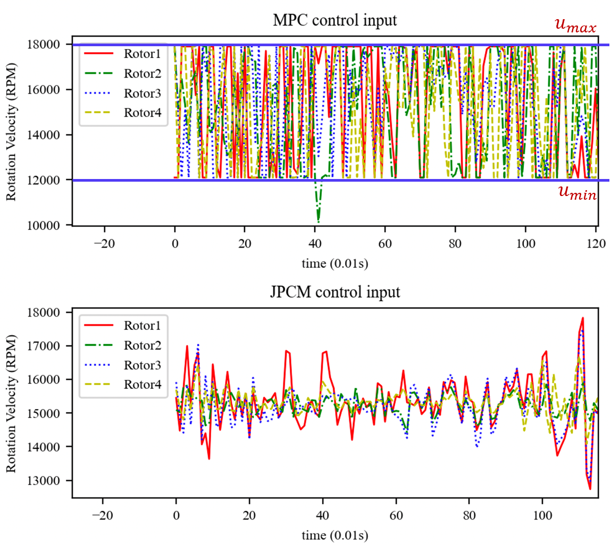
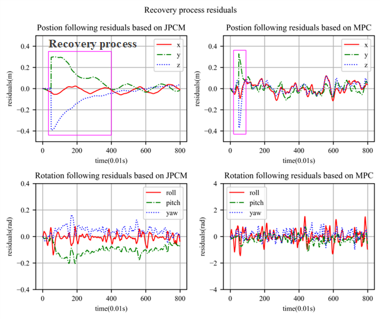
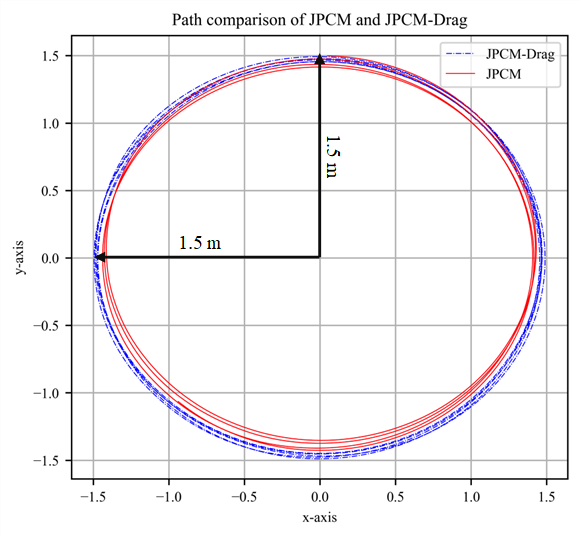

# Factor Graph-Based Model Predictive Control (MPC) Implementation

This repository presents a factor graph-based Model Predictive Control (MPC) implementation for Unmanned Aerial Vehicles (UAVs), validated through real-world experiments. The source code is publicly accessible, with details provided below.

## Repository
Access the code here:  
[GitHub Repository: RoboticsPolyu/jpcm](https://github.com/RoboticsPolyu/jpcm)

## Contact
For code access, collaboration, or inquiries, please contact:  
**Email**: [peiwen1.yang@connect.polyu.hk](mailto:peiwen1.yang@connect.polyu.hk)

## Note
The repository is currently under active development, with limited documentation due to time constraints. Contributions, feedback, or suggestions to enhance the codebase are highly appreciated.

---

# Tightly Joined Positioning and Control Model (JPCM) for UAVs Using Factor Graph Optimization

## Abstract
Unmanned Aerial Vehicles (UAVs) rely heavily on robust navigation systems for mission execution. Traditional navigation pipelines separate positioning and control into sequential processes, which struggle to handle uncertainties from measurement noise, environmental disturbances, and nonlinear dynamics. This decoupling compromises UAV reliability in dynamic environments, such as urban areas where Global Navigation Satellite System (GNSS) signals are degraded by reflections from high-rise buildings or where complex wind patterns challenge control algorithms. To address these issues, we propose a **Tightly Joined Positioning and Control Model (JPCM)** based on **Factor Graph Optimization (FGO)**. The JPCM integrates sensor measurements and control constraints into a unified probabilistic factor graph, where positioning data and Model Predictive Control (MPC) are formulated as factors. By solving this factor graph, the model leverages the complementary nature of positioning and control, achieving enhanced navigation resilience. We validate the approach using a simulated quadrotor system, demonstrating superior trajectory tracking performance.

**Simulation Video**: [YouTube Link](https://youtu.be/QBPwTr4mFy4)  
**Code Repository**: [git@github.com:RoboticsPolyu/jpcm.git](git@github.com:RoboticsPolyu/jpcm.git)  
**Recommended Use**: The FGO-MPC framework is ideal for research and engineering applications in UAV navigation.  
**Dependencies**: GTSAM, Pangolin, and related libraries.

## Authors
- **Peiwen Yang** (peiwen1.yang@connect.polyu.hk)  
- **Weisong Wen*** (Corresponding Author, welson.wen@polyu.edu.hk)  
- **Shiyu Bai**, Member, IEEE  
- **Li-Ta Hsu**, Senior Member, IEEE  
_Affiliation_: Department of Aeronautical and Aviation Engineering, The Hong Kong Polytechnic University, Hong Kong, China.

## Updates
- **Dynamic Obstacle Avoidance**: Integrated **Control Barrier Functions (CBF)** with factors `CBFPdFactor` and `VeCBFPdFactor`.  
  - Reference: [VeCBFPdFactor Mathematical Formulation.pdf](https://github.com/RoboticsPolyu/jpcm/blob/main/docs/VeCBFPdFactor_Mathematical_Formulation.pdf)  
  - Test Script: `JPCM_TGyro_CBF_Test.cpp`

## Problem Description
UAV navigation in smart cities faces safety challenges due to environmental uncertainties, such as GNSS signal degradation and wind disturbances in urban canyons. The following figure illustrates these challenges (sourced from Google Earth):



## Unified Factor Graph Framework
The JPCM integrates positioning and control constraints into a single factor graph, enabling joint optimization. Below are visual representations of the pipeline and factor graph:

| Pipeline Overview | Factor Graph Structure |
|-------------------|-----------------------|
|  |  |

## Usage Instructions
### 1. MPC and JPCM Configuration
- **Module**: `Joint_Estimation_Control`
- **Configuration File**: Modify `factor_graph.yaml` to adjust parameters. For MPC-specific settings, update:
  ```yaml
  PRI_VICON_COV: 0.001
  PRI_VICON_VEL_COV: 0.001
  ```
- **Inequality Constraints**: Rotational speed constraints are defined in `hin_Joint_Estimation_Control`. Adjust:
  ```yaml
  CLF_HIGH: 18000
  CLF_LOW: 1000
  CLF_THR: 100
  CLF_ALPHA: 1
  ```

### 2. JPCM with Sliding Window
- **Module**: `SW_Joint_Estimation_Control`
- **Description**: Implements a sliding window approach for improved computational efficiency.

## Simulation Results
### Position Tracking
The figures below compare the tracking performance of MPC and JPCM (linear speed: 5 m/s, radius: 1.5 m). The red and blue lines represent MPC and JPCM paths, respectively.

| Paths of MPC and JPCM | Control Input |
|-----------------------|---------------|
|  |  |

### Disturbance Rejection
The JPCM demonstrates robust recovery from environmental disturbances:

| Rapid Wind Recovery | Aerodynamic Drag Elimination |
|---------------------|------------------------------|
|  |  |

- **Left**: Recovery process after encountering rapid winds.  
- **Right**: JPCM-Drag effectively mitigates aerodynamic drag effects.

## Acknowledgments
This research is supported by:  
- **MEITUAN ACADEMY OF ROBOTICS SHENZHEN**: Project “Vision Aided GNSS-RTK Positioning for UAV System in Urban Canyons (ZGHQ)”.  
- **PolyU Research Institute for Advanced Manufacturing (RIAM)**: Project “Unmanned Aerial Vehicle Aided High Accuracy Addictive Manufacturing for Carbon Fiber Reinforced Thermoplastic Composites Material (CD8S)”.

## Author Details
- **Peiwen Yang**: Ph.D. student, Department of Aeronautical and Aviation Engineering, The Hong Kong Polytechnic University. M.S. (2019) from Beijing Institute of Technology. Research interests: aerial vehicle control, computer vision, robotics.  
  _Email_: peiwen1.yang@connect.polyu.hk  
- **Weisong Wen** (Corresponding Author): Department of Aeronautical and Aviation Engineering, The Hong Kong Polytechnic University.  
  _Email_: welson.wen@polyu.edu.hk

