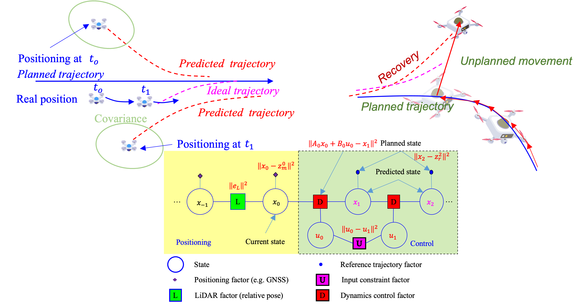
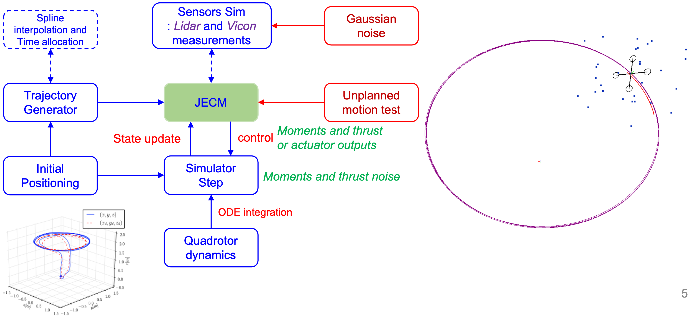
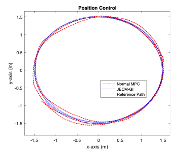

Joint Positioning and Control Method

Unmanned aerial vehicles (UAV) showed great potential in improving the efficiency of parcel delivery applications in the coming smart cities era. Unfortunately, the trustworthy positioning and control algorithms of the UAV are significantly challenged in complex urban areas. For example, the ubiquitous global navigation satellite system (GNSS) positioning can be degraded by the signal reflections from surrounding high-rising buildings, leading to significantly increased positioning uncertainty. An additional challenge is introduced to the control algorithm due to the complex wind disturbances in urban canyons. Given the fact that the system positioning and control are highly correlated with each other, for example, the system dynamics of the control can largely help with the positioning, this paper proposed a joint positioning and control method (JPCM) based on factor graph optimization (FGO), which combines sensors' measurements and control intention. In particular, the positioning measurements are formulated as the factors in the factor graph model, such as the positioning from the GNSS. The model predictive control (MPC) is also formulated as the additional factors in the factor graph model. By solving the factor graph contributed by both the positioning factor and the MPC-based factors, the complementariness of positioning and control can be fully explored. To guarantee reliable system dynamic parameters, we validate the effectiveness of the proposed method using a simulated quadrotor system which showed significantly improved trajectory following performance. To benefit the research community, we open-source our code and make it available at https://github.com/RoboticsPolyu/IPN\_MPC. 

The unified factor graph is as follows:

The simulation results are as follows:

More details:
