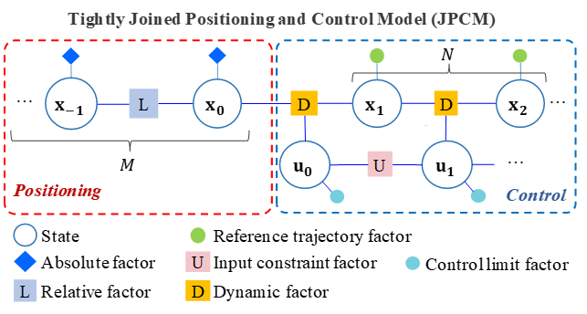

# Factor Graph-Based MPC Implementation

We have implemented factor graph-based Model Predictive Control (MPC) in real-world experiments. The code is available in the following repository:

[GitHub Repository: RoboticsPolyu/jpcm](https://github.com/RoboticsPolyu/jpcm)

## Contact
For access to the code or further inquiries, please reach out to me at:  
**Email**: [peiwen1.yang@connect.polyu.hk](mailto:peiwen1.yang@connect.polyu.hk)

## Note
Due to time constraints, the repository currently lacks detailed documentation and regular maintenance. I appreciate your understanding and welcome any feedback or contributions to improve it.

Thank you for your interest!

# Tightly Joined Positioning and Control Model for Unmanned Aerial Vehicles Based on Factor Graph Optimization

## Abstract

#write{
The execution of flight missions by unmanned aerial vehicles (UAV) primarily relies on navigation. In particular, the navigation pipeline has traditionally been divided into positioning and control, operating in a sequential loop. However, the existing navigation pipeline, where the positioning and control are decoupled, struggles to adapt to ubiquitous uncertainties arising from measurement noise, abrupt disturbances, and nonlinear dynamics. As a result, the navigation reliability of the UAV is significantly challenged in complex dynamic areas. For example, the ubiquitous global navigation satellite system (GNSS) positioning can be degraded by the signal reflections from surrounding high-rising buildings in complex urban areas, leading to significantly increased positioning uncertainty. An additional challenge is introduced to the control algorithm due to the complex wind disturbances in urban canyons. Given the fact that the system positioning and control are highly correlated with each other, this research proposes a **tightly joined positioning and control model (JPCM) based on factor graph optimization (FGO)**. In particular, the proposed JPCM combines sensor measurements from positioning and control constraints into a unified probabilistic factor graph. Specifically, the positioning measurements are formulated as the factors in the factor graph. In addition, the model predictive control (MPC) is also formulated as the additional factors in the factor graph. By solving the factor graph contributed by both the positioning-related factors and the MPC-based factors, the complementariness of positioning and control can be deeply exploited. Finally, we validate the effectiveness and resilience of the proposed method using a simulated quadrotor system which shows significantly improved trajectory following performance. 

text-align: justify;
display: block;

}
The simulation video is here: https://youtu.be/QBPwTr4mFy4

This repository depends on GTSAM, Pangolin, and so on.

## Authors
Peiwen Yang, Weisong Wen*, Member, IEEE, Shiyu Bai, Member, IEEE, and Li-Ta Hsu, Senior Member, IEEE

## Updates
1. Dynamic Obstacle Avoidance Based on **Control Barrier Functions**

Factor CBFPdFactor and factor VeCBFPdFactor (VeCBFPdFactor Mathematical Formulation.pdf)

Run JPCM_TGyro_CBF_Test.cpp 

## Problem description
The safety challenges of intelligent transportation in smart cities (the background figure is from Google Earth).

<div align=center></div>

## The unified factor graph
|
---|---

## Usage

MPC and JPCM: 
Joint_Estimation_Control

You could modify factor_graph.yaml to adjust the parameters. If you want to run MPC, please modify parameters: 

```PRI_VICON_COV: 0.001 
PRI_VICON_VEL_COV: 0.001
```

There are inequality constraints, which are constraints on the rotational speed：
hin_Joint_Estimation_Control

You could modify parameters:

```CLF_HIGH:  18000
CLF_LOW:   1000
CLF_THR:   100
CLF_ALPHA: 1
```

JPCM with Sliding Window:

SW_Joint_Estimation_Control

## The simulation results

### Position tracking

<center class="half">


</center>

The paths of MPC and JPCM (linear speed = 5m/s, radius = 1.5m). The red solid line and blue solid line represent the tracking path based on MPC and the tracking path based on JPCM, respectively.

### Disturbances


 | 
---|---

Left: Recovery process after encountering rapid winds

Right: JCPM-Drag can eliminate aerodynamic drag effects

### JPCM Based on Sliding Window:


### JPCM 

## Acknowledgment 
This paper is funded by the MEITUAN ACADEMY OF ROBOTICS SHENZHEN under the project “Vision Aided GNSS-RTK Positioning for UAV System in Urban Canyons (ZGHQ)”. This paper is also funded by the PolyU Research Institute for Advanced Manufacturing (RIAM) under the project “Unmanned Aerial Vehicle Aided High Accuracy Addictive Manufacturing for Carbon Fiber Reinforced Thermoplastic Composites Material (CD8S)”. 

## Author details:
YANG, Peiwen (peiwen1.yang@connect.polyu.hk): Peiwen Yang received the M.S. degree in the School of Information and Electronics, Beijing Institute of Technology, Beijing, China, in 2019. He is currently a Ph.D. student in the Department of Aeronautical and Aviation Engineering, at the Hong Kong Polytechnic University. His current research interests include aerial vehicle control, computer vision, and robotics.

Weisong, Wen is the corresponding author. The authors are with the Department of Aeronautical and Aviation Engineering, The Hong Kong Polytechnic University, HongKong, China (e-mail: welson.wen@polyu.edu.hk).
